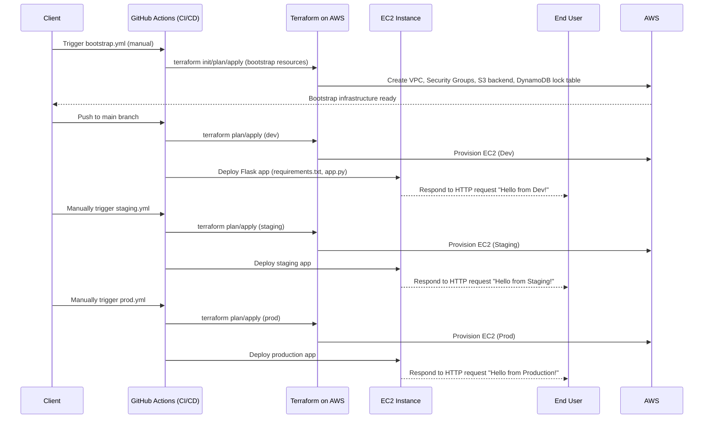

# Flask App Deployment: A Step-by-Step Guide

Welcome to your automated web application deployment solution. This guide will walk you through the process of deploying and managing your Flask application on AWS.

## 1. Overview

This project automates the entire process of deploying your web application. When you push code to the `main` branch, a GitHub Actions workflow is triggered. This workflow uses Terraform to create the necessary AWS infrastructure and then deploys the Flask application to the newly created EC2 instances.

The infrastructure is managed per environment (dev, staging, prod), allowing for isolated deployments and testing.

### 1.1 Technical Details

This section provides a brief overview of the technologies used in this project.

*   **Flask:** A lightweight Python web framework.
*   **Terraform:** An open-source infrastructure as code tool that allows you to build, change, and version infrastructure safely and efficiently.
*   **GitHub Actions:** A CI/CD platform that allows you to automate your build, test, and deployment pipeline.
*   **AWS (Amazon Web Services):** A cloud computing platform that provides a variety of services, including EC2 for virtual servers, S3 for storage, and DynamoDB for a NoSQL database.

### File Repository Structure

```
.
├── .github/workflows     # GitHub Actions CI/CD pipeline
│   ├── deploy.yml        # Deployment workflow for dev
│   ├── destroy.yml # Manual deployment for 
│   ├── menual_deploy_pro.yml # Manual deployment for Production
│   ├── menual_deploy_stage.yml # Manual deployment for Staging
├── assets
│   ├── credentials.png   # Screenshots
production
│   └── menual_deploy_stage.yml # Manual deployment for staging
├── app                   # Flask application code
│   ├── app.py            # Main application file
│   └── requirements.txt  # Python dependencies
├── README.md             # This file
├── scripts               # Deployment and setup scripts
│   ├── deploy.sh         # Deploys the app to EC2
│   └── setup_ec2.sh      # Sets up the EC2 instance
└── terraform             # Terraform configuration
    ├── environments
    │   ├── dev
    │   ├── prod
    │   └── staging
    └── modules
        └── web_app
```

### Full Lifecycle of Application




## 2. Prerequisites

#### 2.1 Adding credentials in GitHub Actions
To use this automated deployment solution, you need to provide the following credentials. Please share these with your development team so they can be securely stored in the project's GitHub repository:

*   `AWS_ACCESS_KEY_ID`: Your AWS access key ID.
*   `AWS_SECRET_ACCESS_KEY`: Your AWS secret access key.
*   `EC2_PRIVATE_KEY`: The private key of your EC2 key pair.
*   `sg_id`   = "sg-xxxxxxxxxxxxxxxxx"  # Replace with your actual security group ID
*   `subnet_id` = "subnet-xxxxxxxxxxxxxxxxx" # Replace with your actual subnet ID


Your development team will handle the rest of the configuration.

#### 2.2 Create S3 bucket / DynamoDB lock for remote state (either console, aws cli, or use bootstrap Terraform).

***Purpose***
- Terraform state locking: Prevents two people from running terraform apply at the same time.

- Used with S3 backend: S3 stores the state, DynamoDB locks it.

***Create S3 bucket / DynamoDB lock for remote state via AWS CLI***

- Example (AWS CLI):

```bash
aws s3api create-bucket --bucket my-terraform-state-bucket --region us-east-1
aws s3api put-bucket-versioning --bucket my-terraform-state-bucket --versioning-configuration Status=Enabled
aws dynamodb create-table --table-name terraform-locks --attribute-definitions AttributeName=LockID,AttributeType=S --key-schema AttributeName=LockID,KeyType=HASH --billing-mode PAY_PER_REQUEST

```
**Note: Update terraform/environments/dev/backend.tf with bucket, key and dynamodb_table.**

#### 2.2.1 Create S3 bucket / DynamoDB lock for remote state (Manual)

Step 1: Create the S3 Bucket (for Terraform State)
- Go to the S3 console.

- Click "Create bucket".

- Set the bucket name (e.g., my-terraform-state-bucket).

- Region: Use same region as where you run Terraform (e.g., us-east-1).

- Uncheck Block all public access (keep it checked for security).

- Enable Bucket Versioning.

- Create the bucket.

✅ This bucket will hold .tfstate files.


Step 2: Create the DynamoDB Table (Terraform Locking)
- Go to the DynamoDB console.

- Click "Create table".

- Table name: flask-lock-table.

- Partition key (Primary key):

- Name: LockID

- Type: String

- Leave other settings as default:

- Billing mode: On-demand (Pay-per-request).

- No sort key.

- No indexes.

- Click Create Table.

✅ This table is used to prevent concurrent Terraform runs.


***Note: AWS credentials with IAM permissions to create S3 and DynamoDB resources.***

#### 2.2.2 Configure Terraform to Use S3 + DynamoDB

In your environment folder (environments/dev/backend.tf), (environments/staging/backend.tf) and (environments/prod/backend.tf) use:

```HCL
terraform {
  backend "s3" {
    bucket         = "my-terraform-state-bucket-50"
    key            = "dev/terraform.tfstate"
    region         = "ap-southeast-1"
    dynamodb_table = "flask-lock-table"
    encrypt        = true
  }
}

```

#### 2.3 Update variables of terraform.tfvars file from dev, staging and production.

```HCL
# terraform.tfvars for the Staging environment
# Provides values for local 'terraform apply' runs by the Team Lead.
# MUST be in .gitignore
key_name = "Your_Keypair"
ami_id   = "ami-0a7d80731ae1b2435" # ubuntu 22.04 AMI ID in us-east-1


```

#### 2.4 Update .gitignore file 

```text
# Terraform
**/.terraform/*
*.tfstate
*.tfstate.*
crash.log
crash.*.log
*.tfvars
*.tfvars.json
override.tf
override.tf.json
*_override.tf
*_override.tf.json
.terraformrc
terraform.rc
```


## 3. How to Deploy Your Application

You have several options for deploying your application, depending on your needs.

### 3.1 Scenario 1: Automatic Deployment to Development

This is the most common scenario. Every time you push new code to the `main` branch of the repository, the application will be automatically deployed to the **development** environment.

**Steps:**

1.  **Push your code changes** to the `main` branch.
2.  **Wait for the deployment to complete.** You can monitor the progress in the "Actions" tab of your GitHub repository.
3.  **Access the application.** Once the deployment is complete, the URL of the development environment will be available in the deployment logs.

### 3.2 Scenario 2: Manual Deployment to Staging

When you want to test a new version of the application in a staging environment before releasing it to production, you can manually trigger a deployment to **staging**.

**Steps:**

1.  Go to the **Actions** tab in your GitHub repository.
2.  In the left sidebar, click on the **Deploy to Staging** workflow.
3.  Click the **Run workflow** button.
4.  From the **Use workflow from** dropdown, select the branch you want to deploy (usually `main`).
5.  Click the **Run workflow** button to start the deployment.
6.  Once the deployment is complete, the URL of the staging environment will be available in the deployment logs.

### 3.3 Scenario 3: Manual Deployment to Production

When you are ready to release a new version of the application to your users, you can manually trigger a deployment to **production**.

**Steps:**

1.  Go to the **Actions** tab in your GitHub repository.
2.  In the left sidebar, click on the **Deploy to Production** workflow.
3.  Click the **Run workflow** button.
4.  From the **Use workflow from** dropdown, select the branch you want to deploy (usually `main`).
5.  Click the **Run workflow** button to start the deployment.
6.  Once the deployment is complete, the URL of the production environment will be available in the deployment logs.

## 4. How to Shut Down an Environment

To avoid unnecessary costs, you can shut down an environment when it is no longer needed. This will delete all the AWS resources associated with that environment.

**Steps:**

1.  Go to the **Actions** tab in your GitHub repository.
2.  In the left sidebar, click on the **Destroy Infrastructure** workflow.
3.  Click the **Run workflow** button.
4.  From the **Environment** dropdown, select the environment you want to destroy (e.g., `dev`, `staging`, or `prod`).
5.  Click the **Run workflow** button to start the process.

**Important:** This action is irreversible. All data stored in the environment will be lost.


